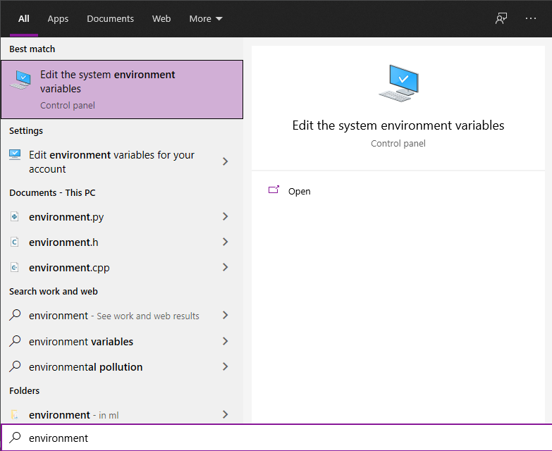
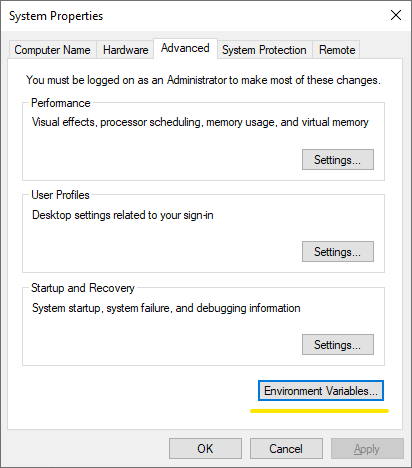
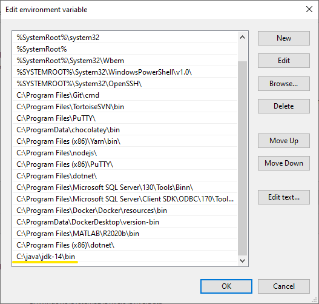

# Local setup

Clone the repo including submodules
```bash
git clone --recurse-submodules git@gitlab.com:reliable-and-scalable-biskup/infrastructure.git
cd infrastructure/local
git submodule update --recursive --remote
```
Start the backend
```bash
./start-backend.sh # Linux
start-backend.bat # Windows
```
Start the platform (MongoDB + Apache Kafka, but without our microservices)
```bash
./start-platform.sh # Linux
start-platform.bat # Windows
```
Stop the backend
```bash
./stop-backend.sh # Linux
stop-backend.bat # Windows
```
Stop the backend and delete all containers
```bash
./kill-backend.sh # Linux
kill-backend.bat # Windows
```
Pull changes from all remote repositories to get the latest backend state
```bash
git pull
git submodule update --recursive --remote
```

# Configuring Java on Windows

Before running the scripts, make sure you have Java 14 installed and correctly configured
* download zip package from https://download.java.net/openjdk/jdk14/ri/openjdk-14+36_windows-x64_bin.zip
* extract it to some folder, for example `C:\java`
* adjust environment variables according to installation folder
    * `JAVA_HOME` - set value to `C:\java`
    * `Path` - append `C:\java\bin` to the existing value








